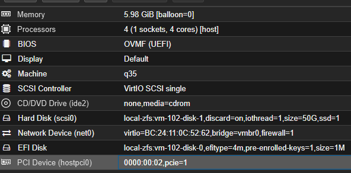
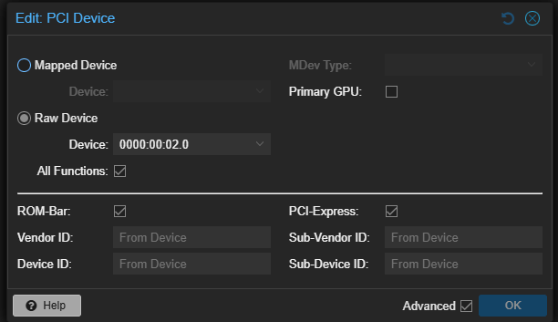
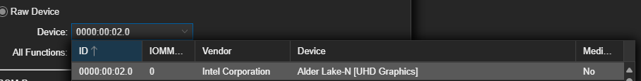

# Plex Hardware Transcoding via Proxmox VM iGPU passthrough
Based on what I see on forums, there is no real single surefire way to get this working, so don't take this as a guaranteed way that it will work for you. It just worked for me.

Special thanks to [https://3os.org/infrastructure/proxmox/gpu-passthrough/igpu-passthrough-to-vm/]() for providing a guide that worked for me, even though I feel like I tried this exact stuff a million times.

# Warning
When you passthrough your iGPU, it will _NO LONGER_ be available for proxmox itself or other VM's / LXC's. Keep this in mind when deciding how to architecture your proxmox setup.

# Legend

| Term    | Explanation      |
| ------------- | ------------- |
| Host | This is proxmox itself. When changing something on the host, it means on your proxmox machine itself, not a VM or LXC. |
| Guest | The VM's / LXC's |

# VM Setup


I think the most important bits here are the Machine and the BIOS (and of course the PCI Device which we will add later in this guide)

I have not tested this with other machine types and other BIOS types.

## Host configuration
Edit the grub configuration file

`nano /etc/default/grub`

Find the line that starts with `GRUB_CMDLINE_LINUX_DEFAULT`, which if unmodified will look like 

```bash
GRUB_CMDLINE_LINUX_DEFAULT="quiet"
```

Change this line to look like follows:

```bash
GRUB_CMDLINE_LINUX_DEFAULT="quiet intel_iommu=on iommu=pt pcie_acs_override=downstream,multifunction initcall_blacklist=sysfb_init video=simplefb:off video=vesafb:off video=efifb:off video=vesa:off disable_vga=1 vfio_iommu_type1.allow_unsafe_interrupts=1 kvm.ignore_msrs=1"
```

I'll be honest, i don't know what 90% of these do. One day I will keep removing stuff until it breaks so I know exactly what is REALLY needed and what is not.

Next create or update your modprobe.d blacklist.

In case you don't have a driver blacklist yet, run:
`nano /etc/modprobe.d/blacklist.conf`

In this file, add the following content:

```
blacklist radeon
blacklist nouveau
blacklist nvidia
blacklist nvidiafb
blacklist nvidia-gpu
blacklist snd_hda_intel
blacklist snd_hda_codec_hdmi
blacklist i915
```
The blacklisting ensures that the drivers are not loaded by proxmox. If proxmox does load the driver, your VM may not start, or your iGPU passthrough will stop working.

Update your grub config: `update-grub`.

Next we need to add vfio modules to allow PCI passthrough.

Edit the `/etc/modules` file.

```bash
nano /etc/modules
```

Add the following line to the end of the file and save:

```bash
vfio
vfio_iommu_type1
vfio_pci
vfio_virqfd # obsolete for recent proxmox versions (8.x+)
```
Update the changes: `update-initramfs -u -k all`

_Reboot proxmox_ and apply all changes made.

## Verify that IOMMU is enabled.
Run: `dmesg | grep -e DMAR -e IOMMU`

There should be a line that looks like DMAR: IOMMU enabled. If there is no output, something is wrong.

## Guest (Linux) VM iGPU Passthrough configuration
This section works for Linux (on my machine) and has been untested for windows.

From the host, run: `lspci -nnv | grep VGA`. 
This should result in an output similar to this:

```bash
00:02.0 VGA compatible controller [0300]: Intel Corporation Alder Lake-N [UHD Graphics] [8086:46d1] (prog-if 00 [VGA controller])
```

In the Proxmox UI, select the VM you want to pass the iGPU to and select hardware. Click add and select PCI Device in the dropdown.

My settings are as follows:


Important bits here are the Device. When you open the dropdown, the iommu groups as shown in the dropdown have more logical names. Find the one that has something with graphics or gpu in the name. For example:

.

Make sure to enable "All Functions" and "ROM-Bar". If you use a q35 device, also select PCI-Express, which should have better performance.

## Check the VM
Having the PCI device added, we are effectively passing through our iGPU. 

To verify this, start the VM and run the following command:

```bash
cd /dev/dri && ls -lah
```
The output should include the `renderD128`.

This should typically be enough. If nothing shows up, you may have to install drivers (apt install for ubuntu.) You have to look up / find your drivers yourself.

When running for example plex in docker compose, add the dev/dri as a device:

```yaml
  plex:
    image: lscr.io/linuxserver/plex:latest
    container_name: plex
    ports:
      - "32400:32400"
    environment:
      - PUID=${PLEX_UID}
      - PGID=${MEDIACENTER_GID}
      - VERSION=docker
      - PLEX_CLAIM=${PLEX_CLAIM}
    volumes:
      - ${ROOT_DIR}/config/plex:/config
      - ${ROOT_DIR}/data:/data
    restart: unless-stopped
    devices:
      - /dev/dri:/dev/dri # This bit
```

And make sure that the user you run PLEX with is also part of the `render` group. If not:

```bash
sudo usermod -aG render $PLEX_USER
```